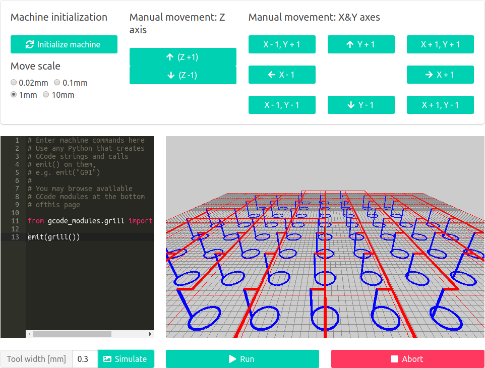

# An experimental milling machine driver with a web interface
This is a milling machine driver that can be managed from a web browser.

Disclaimer: I wrote this app to learn how CNC machines, G-code etc.
work - it may not be stable yet. If you want to get actual stuff done,
you may prefer to use different, production-ready milling machine software.


## App screenshot


## How to connect
This tool, by default, uses an Arduino microcontroller connected via serial port
that interfaces with stepper motor drivers. The output pin numbers for `DIR` and `PUL`
stepper motor driver inputs for each axis are currently defined in
`src/machine/arduino/main/pinout.h`.

## How to re-upload the binary to your Arduino microcontroller
To upload the code to your Arduino microcontroller, run the following commands,
assuming your Arduino binary resides in `$HOME/Downloads/arduino-1.8.*/arduino`:

```bash

cd src/machine/arduino/
ARDUINO_BINARY=$HOME/Downloads/arduino-1.8.*/arduino make upload
```

## Installation prerequisites
To run this tool, you need to install `python3` and `python3-virtualenv`.

You don't have to have an Arduino - without it, you will still be able
to play with the tool - but without any actual milling.

## How to run
To run the web interface, execute the following command:

```bash
./launch.sh
```

The interface will listen on http://127.0.0.1:5000/.

## How to check code style (via flake8)
To check the code style, execute the following command:

```bash
./run_flake8.sh
```

## How to run the tests
To run the tests, execute the following command:

```bash
./run_tests.sh
```
